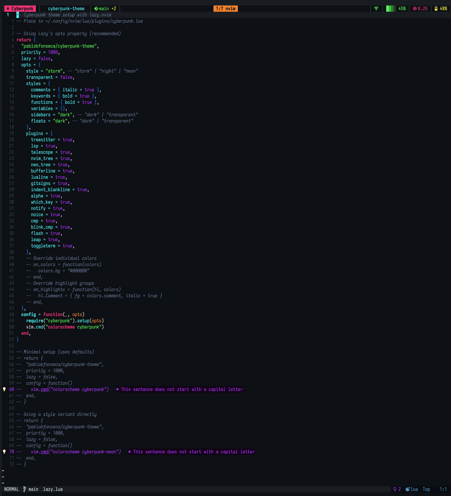
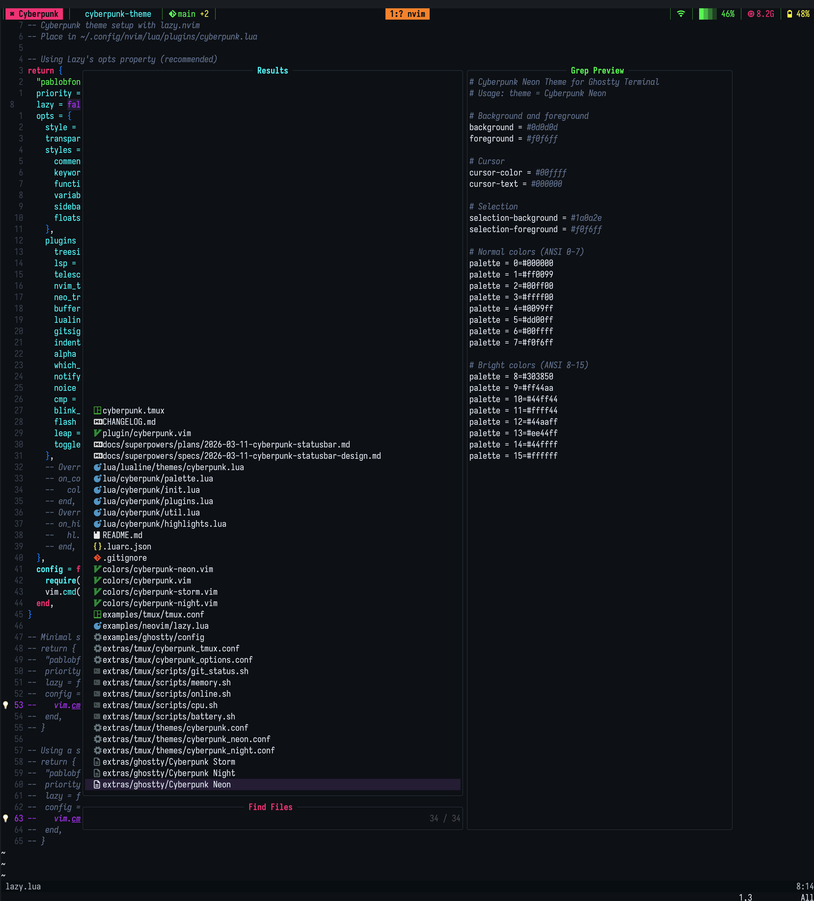
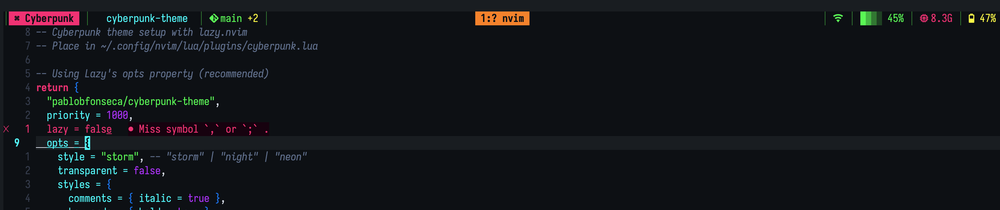

# 🌃 Cyberpunk Theme

> A neon-soaked, electric aesthetic theme suite for Neovim, tmux, Ghostty, VSCode, and more

**Welcome to the grid.** This theme brings the electric, neon-drenched aesthetics of cyberpunk to your development environment. Built with modern Neovim APIs and designed for the latest terminal technologies.



## 📦 Ports

| Platform | Link |
|----------|------|
| Neovim | [Installation](#neovim-theme) · [Config](#neovim-setup) · [Plugins](#-plugin-support) |
| tmux | [Installation](#tmux-theme) |
| Ghostty | [Installation](#ghostty-theme) |
| Starship | [Installation](#starship-prompt) |
| VSCode | [Installation](#vscode-theme) |
| ChatGPT | [Install with Stylus](#userstyles-chatgpt--claude) |
| Claude | [Install with Stylus](#userstyles-chatgpt--claude) |
| Claude Code | [Statusline](#claude-code-statusline) |

## ⚡ Quick Install

```bash
git clone https://github.com/pablobfonseca/cyberpunk-theme.git
cd cyberpunk-theme/installer
npm install
node index.js
```

Interactive wizard that installs any combination of themes. Use `--dry-run` to preview changes.

## ✨ Features

- 🎨 **Full spectrum neon palette** - Electric pinks, cyan blues, matrix greens, and purple hazes
- ⚡ **Modern Neovim support** - Built for Neovim 0.9+ with Lua, Treesitter, and LSP semantic tokens
- 🔧 **Extensive plugin support** - 20+ popular plugins styled with cyberpunk aesthetics
- 🖥️ **Terminal suite** - Matching themes for tmux, Ghostty, and Starship prompt
- 💻 **VSCode theme** - Full editor + syntax highlighting for Visual Studio Code
- 🌐 **Userstyles** - Stylus themes for ChatGPT and Claude
- 🎯 **True color support** - Designed for modern terminals with full RGB support
- 🌐 **Semantic highlighting** - LSP-aware syntax highlighting with meaningful color coding
- 🤖 **Claude Code statusline** - Cyberpunk powerline for Claude Code sessions
- 🪟 **LSP float styling** - Custom borders, diagnostic glyphs, nvim 0.11+ winborder support

## 🎨 Color Palette

```
🌃 Backgrounds:    #0a0e14 (main) • #060a0f (dark) • #0e1419 (float)
💫 Foregrounds:    #e0e6f0 (main) • #b4bcc8 (dark) • #3b4458 (gutter)

🔴 Neon Pink:      #ff007f    🔵 Electric Blue:   #0080ff
🟢 Matrix Green:   #00ff41    🟣 Neon Purple:     #bf00ff
🟡 Cyber Yellow:   #ffff00    🟠 Neon Orange:     #ff8800
🔷 Electric Cyan:  #00ffff    ⚪ Bright White:    #ffffff
```

## 🚀 Installation

### Neovim Theme

Using [lazy.nvim](https://github.com/folke/lazy.nvim):

```lua
{
  'pablobfonseca/cyberpunk-theme',
  priority = 1000,
  config = function()
    require('cyberpunk').setup({
      -- Your config here
    })
    vim.cmd('colorscheme cyberpunk')
  end,
}
```

Using [packer.nvim](https://github.com/wbthomason/packer.nvim):

```lua
use {
  'pablobfonseca/cyberpunk-theme',
  config = function()
    require('cyberpunk').setup()
    vim.cmd('colorscheme cyberpunk')
  end
}
```

Manual installation:

```bash
git clone https://github.com/pablobfonseca/cyberpunk-theme.git ~/.config/nvim/pack/plugins/start/cyberpunk-theme
```

### Tmux Theme

**With [TPM](https://github.com/tmux-plugins/tpm):**

```bash
set -g @plugin 'pablobfonseca/cyberpunk-theme'
```

**Manual (local clone):**

```bash
# Add to your ~/.tmux.conf
run '~/path/to/cyberpunk-theme/cyberpunk.tmux'
```

**Options** (set before loading):

```bash
set -g @cyberpunk_flavor "storm"           # storm | night | neon
set -g @cyberpunk_pane_dim "yes"           # dim inactive panes
set -g @cyberpunk_pane_borders "yes"       # neon pane borders
set -g @cyberpunk_popup "yes"              # popup styling
set -g @cyberpunk_messages "yes"           # message/mode/clock styling
set -g @cyberpunk_status_background "theme" # theme | none (transparent)
```

**Built-in Glitch Statusbar:**

The theme ships a full statusbar out of the box — no manual configuration needed.

```
│ ⌘ session │  dir │ 󰊢 branch +3 ~1 │     1:zsh│2:nvim│3:logs     │ 󰖩 │ █▓▒░ 23% │ 󰍛 2.1G │ 󰁹 85% │
```

- **Left:** session name (prefix-aware), current directory, git branch + dirty state, zoom indicator
- **Right:** online/offline, CPU % with color-coded bar, memory usage, battery %
- **Center:** windows with thin separators, active window highlighted
- All gadgets color-shift at warning thresholds (high CPU, low battery, offline)
- Git info and its separator auto-hide when not in a repo
- System scripts bundled — no external plugin dependencies (supports macOS + Linux)

To override, set your own `status-left`/`status-right` after loading the theme.

**Features:**

- 🔍 **Pane dimming** - inactive panes dimmed for better focus (toggleable)
- ⚡ **Theme variables** - `@thm_*` palette for custom status bar overrides
- 🎯 **Neon pane borders** - active panes highlighted with cyan
- 🎨 **Three variants** - storm (default), night (muted), neon (max saturation)
- 🔧 **Toggleable features** - enable/disable individual styling features

### Ghostty Theme

Copy the theme files to your Ghostty themes directory:

```bash
cp extras/ghostty/Cyberpunk\ * ~/.config/ghostty/themes/
```

Then set your variant in your Ghostty config:

```
theme = Cyberpunk Storm
# or: Cyberpunk Night, Cyberpunk Neon
```

Supports automatic light/dark switching:

```
theme = dark:Cyberpunk Night,light:Cyberpunk Storm
```

### Starship Prompt

```bash
cp extras/starship/cyberpunk-storm.toml ~/.config/starship.toml
```

Three palettes: `cyberpunk_storm`, `cyberpunk_neon`, `cyberpunk_night` — swap via `palette = "cyberpunk_*"` at the top of the file.

**Segments:**

- Directory with truncation + read-only indicator
- Git branch + status (dirty, ahead/behind)
- Language versions: Rust, Go, Python, Node, Lua
- Vim mode indicator (NORMAL / INSERT / VISUAL)
- Command duration timer

### Claude Code Statusline

True-color ANSI statusline for [Claude Code](https://claude.ai/code) sessions.

```bash
npm install -g @pablobfonseca/claude-cyberpunk-powerline
# or use via npx (no install needed)
```

Add to `~/.claude/settings.json`:

```json
{
  "statusLine": {
    "type": "command",
    "command": "npx -y @pablobfonseca/claude-cyberpunk-powerline --style=storm"
  }
}
```

**Styles:** `storm` (default) | `night` | `neon`

**Segments:** model name, context bar (color-shifts as context fills), session cost, lines changed, project name, token count

**Flags:** `--style=<variant>`, `--git` (append current branch)

### VSCode Theme

Install from a local clone:

1. Open VSCode → `Cmd+Shift+P` → **"Developer: Install Extension from Location..."**
2. Select `extras/vscode` from this repo
3. `Cmd+K Cmd+T` → choose **Cyberpunk Storm**, **Cyberpunk Night**, or **Cyberpunk Neon**

Includes full UI chrome colors and syntax token highlighting across all 3 variants.

### Userstyles (ChatGPT & Claude)

Browser themes via the [Stylus](https://github.com/openstyles/stylus) extension. Click to install:

**ChatGPT:**
[](https://raw.githubusercontent.com/pablobfonseca/cyberpunk-theme/main/extras/userstyles/chatgpt/cyberpunk-storm.user.css)
[](https://raw.githubusercontent.com/pablobfonseca/cyberpunk-theme/main/extras/userstyles/chatgpt/cyberpunk-night.user.css)
[](https://raw.githubusercontent.com/pablobfonseca/cyberpunk-theme/main/extras/userstyles/chatgpt/cyberpunk-neon.user.css)

**Claude:**
[](https://raw.githubusercontent.com/pablobfonseca/cyberpunk-theme/main/extras/userstyles/claude/cyberpunk-storm.user.css)
[](https://raw.githubusercontent.com/pablobfonseca/cyberpunk-theme/main/extras/userstyles/claude/cyberpunk-night.user.css)
[](https://raw.githubusercontent.com/pablobfonseca/cyberpunk-theme/main/extras/userstyles/claude/cyberpunk-neon.user.css)

Overrides native CSS custom properties only (dark mode) — no class selectors, resilient to site updates.

## ⚙️ Configuration

### Neovim Setup

```lua
require('cyberpunk').setup({
  -- Theme variant
  style = "storm", -- storm, night, neon

  -- Transparency
  transparent = false,

  -- Terminal colors
  terminal_colors = true,

  -- Style customization
  styles = {
    comments = { italic = true },
    keywords = { bold = true },
    functions = { bold = true },
    variables = {},
    sidebars = "dark", -- dark, transparent
    floats = "dark", -- dark, transparent
  },

  -- Plugin integrations
  plugins = {
    -- Core editing
    treesitter = true,
    lsp = true, -- enables LSP semantic token highlights

    -- File exploration
    telescope = true,
    nvim_tree = true,
    neo_tree = true,
    oil = true,

    -- UI enhancements
    bufferline = true,
    lualine = true,
    alpha = true,
    which_key = true,
    notify = true,
    noice = true,

    -- Code completion
    cmp = true,
    blink_cmp = true,

    -- Git integration
    gitsigns = true,
    fugitive = true,

    -- Navigation
    flash = true,
    leap = true,

    -- Terminal
    toggleterm = true,

    -- Code display
    indent_blankline = true,
  }
})
```

### Color Customization

```lua
-- Access colors directly
local colors = require('cyberpunk.palette').colors

-- Override specific colors
require('cyberpunk').setup({
  on_colors = function(colors)
    colors.neon_pink = "#ff0080"  -- Custom neon pink
    colors.bg = "#000000"         -- Pure black background
  end,

  on_highlights = function(highlights, colors)
    highlights.Comment = { fg = colors.neon_cyan, style = "italic" }
    highlights.Function = { fg = colors.neon_green, style = "bold" }
  end,
})
```

### LSP UI Module

Opt-in module at `lua/cyberpunk/lsp.lua` — enables cyberpunk-styled LSP floats and diagnostics:

```lua
require('cyberpunk').setup({
  plugins = { lsp = true },
})

-- Opt-in LSP UI styling (separate from semantic highlights)
require('cyberpunk.lsp').setup()
```

**What it configures:**

- Box-drawing borders on hover/signature help floats
- Diagnostic signs: block glyphs `█▓▒░` per severity
- Virtual text prefixed with `▌`
- Nvim 0.11+ `winborder` with pre-0.11 fallback
- Undercurl diagnostics, bold signs, severity-sorted display

### CMP Border Helper

The LSP module exports a `cmp_border()` helper for consistent completion window borders:

```lua
local border = require("cyberpunk.lsp").cmp_border()
cmp.setup({
  window = {
    completion  = { border = border, winhighlight = "Normal:NormalFloat,FloatBorder:CmpBorder,CursorLine:Visual,Search:None" },
    documentation = { border = border, winhighlight = "Normal:NormalFloat,FloatBorder:CmpBorder,CursorLine:Visual,Search:None" },
  },
})
```

## 🔌 Plugin Support

The theme includes first-class support for:

### 🔍 **Navigation & Search**

- Telescope - Per-pane backgrounds, per-section colored borders (pink prompt, cyan results, green preview), multi-select indicators (orange icons, purple bold); respects `styles.floats` setting
- Flash/Leap - Electric motion highlighting
- Which-key - Glowing key binding hints

### 📁 **File Management**

- Nvim-tree - Cyberpunk file explorer styling
- Neo-tree - Modern file tree with neon accents
- Oil.nvim - Directory editing with electric highlights

### ⌨️ **Code Editing**

- Treesitter - Semantic syntax highlighting
- LSP - Semantic highlights + opt-in float styling via `cyberpunk.lsp` (see [LSP UI Module](#lsp-ui-module))
- nvim-cmp/Blink.cmp - Futuristic completion menus with `cmp_border()` helper
- Indent Blankline - Subtle indentation guides

### 🎨 **UI Enhancement**

- Lualine - Electric statusline
- Bufferline - Neon buffer tabs
- Alpha - Cyberpunk dashboard
- Notify - Glowing notifications
- Noice - Enhanced UI components

### 🔧 **Git Integration**

- GitSigns - Visual git status with neon colors
- Fugitive - Git workflow enhancement

### 💻 **Terminal**

- ToggleTerm - Floating terminal with themed borders
- Built-in terminal - Full color palette support

## 🎯 Language Support

Optimized highlighting for:

- **JavaScript/TypeScript** - Framework-aware highlighting
- **Python** - Enhanced syntax distinction
- **Rust** - Memory-safe neon aesthetics
- **Go** - Clean, efficient color coding
- **Lua** - Neovim configuration highlighting
- **C/C++** - System-level programming clarity
- **HTML/CSS** - Web development with style
- **Markdown** - Documentation with flair
- **JSON/YAML** - Configuration file clarity
- **Bash/Zsh** - Shell scripting enhancement

## 🚀 Performance

- ⚡ **Lazy loading** - Only loads highlights when needed
- 🎨 **Optimized palette** - Efficient color calculations
- 💾 **Memory efficient** - Minimal runtime overhead
- 🔄 **Fast switching** - Quick theme changes

## 🤝 Contributing

Contributions welcome! Areas of focus:

- 🎨 Additional color variants
- 🔌 More plugin integrations
- 🐛 Bug fixes and improvements
- 📖 Documentation enhancements
- 🖥️ Additional terminal support

### Development Setup

```bash
git clone https://github.com/pablobfonseca/cyberpunk-theme.git
cd cyberpunk-theme

# Test the theme
ln -sf $(pwd) ~/.config/nvim/pack/dev/start/cyberpunk-theme
nvim +CyberpunkReload
```

## 📸 Screenshots

### Storm (default)

**Telescope** — fuzzy finder with file preview



**LSP Diagnostics** — inline warnings with tmux statusbar



<!-- TODO: add night and neon variant screenshots -->

## 🛠️ Terminal Requirements

For the best experience:

- **True color support** (24-bit color)
- **Modern terminal emulator** (Ghostty, Alacritty, Kitty, iTerm2, etc.)
- **Neovim 0.9+** for full feature support
- **Nerd Font** for icon support (optional but recommended)

## 📦 Similar Themes

Inspired by and compatible with the cyberpunk aesthetic family:

- Tokyo Night - Clean, modern dark theme
- Synthwave '84 - Retro neon aesthetics
- Monokai Pro - Enhanced Monokai variants
- Dracula - Popular vampire theme

## 📝 License

MIT License - Feel free to hack the gibson with this theme!

## 🌟 Acknowledgments

- Inspired by cyberpunk culture and neon city aesthetics
- Built on the excellent foundation of modern Neovim theming
- Thanks to the amazing plugin ecosystem that makes this possible

---

**"The future is now. Make it neon."** ⚡🌃
